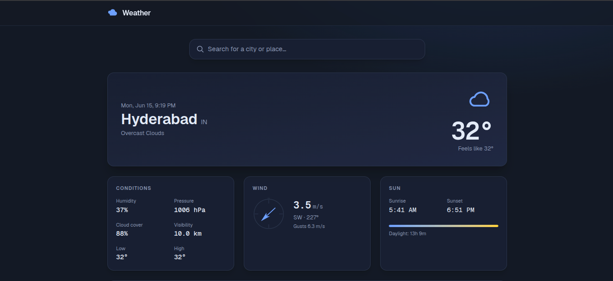
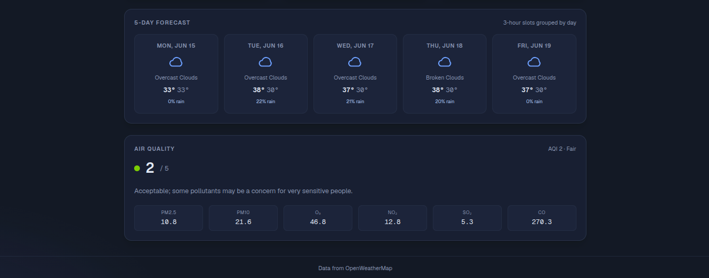

# Weather Dashboard

A modern weather dashboard built with **Next.js 16** and **React 19**, powered by the **OpenWeatherMap API**. Search for any city, grant geolocation access for local conditions, and see current weather, a 5-day forecast, air quality, wind, and sunrise/sunset — all in a clean, dark-themed UI.



*Screenshot 1: Home view showing the search bar, current conditions for Hyderabad (32°, Overcast Clouds), the Conditions / Wind / Sun metrics cards, and the 5-day forecast strip + Air Quality card.*

---

## Features

- **City search** — autocomplete-powered search with the OpenWeatherMap Geocoding API. Hit enter or pick a suggestion to load that location.
- **Current conditions** — temperature, "feels like", weather icon, condition text, date/time, and the country code.
- **Conditions grid** — humidity, pressure, cloud cover, visibility, and the day's low/high.
- **Wind card** — speed (m/s), direction (degrees + compass), and gusts. Direction is shown both numerically and as a rotating compass arrow.
- **Sun card** — sunrise, sunset, and a daylight progress bar with a daylight duration label.
- **5-day forecast** — daily high/low, an icon, a condition summary, and the chance of rain (taken from the OpenWeatherMap 3-hour forecast, grouped by day).
- **Air quality card** — AQI score out of 5, label (e.g. *Fair*), and a breakdown of pollutants (PM2.5, PM10, O₃, NO₂, SO₂, CO).
- **Responsive dark UI** — Geist + Geist Mono fonts, a navy/slate palette, mobile-first layout that scales up to a 5xl container.
- **ISR caching** — weather/forecast/air-pollution data is cached for 10 minutes (`next: { revalidate: 600 }`) on the server. Geocoding results are fetched fresh on every search.

---

## Screenshots

### Home view — current conditions + metrics



*Screenshot 2: The full layout including the 5-day forecast strip (Mon Jun 16 – Fri Jun 19) and the Air Quality card (AQI 2/5, Fair) with per-pollutant values.*

---

## Tech stack

| Layer       | Choice                                                        |
| ----------- | ------------------------------------------------------------- |
| Framework   | Next.js `16.2.7` (App Router)                                 |
| UI          | React `19.2.4`                                                |
| Language    | TypeScript `5` (strict mode, `bundler` resolution)            |
| Styling     | Tailwind CSS `v4` via `@tailwindcss/postcss`                  |
| Fonts       | Geist + Geist Mono via `next/font/google`                     |
| Data        | OpenWeatherMap REST API (server-side fetches with ISR)        |
| Lint/Format | ESLint `9` (flat config) + Prettier `3.8.3`                   |

> **Heads up:** Next.js 16 has breaking changes vs. earlier versions. Conventions and APIs may differ from older training data. The bundled guide lives at `node_modules/next/dist/docs/` — read the App Router sections there before changing routing or data-fetching code. `AGENTS.md` carries the same warning.

---

## Project layout

```
.
├── AGENTS.md                          # Next.js 16 warning for AI agents
├── CLAUDE.md                          # Claude Code project instructions
├── eslint.config.mjs                  # ESLint flat config
├── next.config.ts                     # Next.js config (currently empty)
├── postcss.config.mjs                 # Tailwind v4 PostCSS plugin
├── public/                            # Static assets
└── src/
    ├── app/
    │   ├── layout.tsx                 # Root layout: header, footer, fonts
    │   ├── page.tsx                   # Home route (search + weather panels)
    │   ├── globals.css                # Tailwind v4 entry + design tokens
    │   ├── [lat]/                     # Dynamic lat-based routes (TBD)
    │   └── api/                       # Route handlers
    │       ├── air-pollution/         # GET /api/air-pollution
    │       ├── forecast/              # GET /api/forecast
    │       ├── geocode/               # GET /api/geocode
    │       └── weather/               # GET /api/weather
    ├── components/
    │   ├── air-quality-card.tsx
    │   ├── card.tsx                   # Base card surface
    │   ├── current-weather-card.tsx
    │   ├── forecast-strip.tsx
    │   ├── location-weather.tsx       # Top-level panel (geolocation + data fetch)
    │   ├── metrics-grid.tsx
    │   ├── search-bar.tsx
    │   ├── sun-card.tsx
    │   ├── weather-icon.tsx           # Maps OWM icon codes to inline SVGs
    │   └── wind-card.tsx
    └── lib/
        ├── api/                       # Server-side API client (fetches OWM)
        │   ├── air-pollution.ts       # fetchAirPollution(lat, lon)
        │   ├── env.ts                 # Reads OPEN_WEATHER_API_KEY
        │   ├── forecast.ts            # fetchForecast(lat, lon)
        │   ├── geocoding.ts           # fetchGeocode(query, limit)
        │   └── weather.ts             # fetchWeather(lat, lon)
        └── types/                     # Per-endpoint TypeScript types
            ├── air-pollution.types.ts # (also exports AQI_LABELS)
            ├── forecast.types.ts
            ├── geocoding.types.ts
            └── weather.types.ts
```

---

## Getting started

### 1. Install dependencies

```bash
npm install
```

### 2. Configure the API key

Create a `.env` file at the project root (it is git-ignored):

```bash
OPEN_WEATHER_API_KEY=your_openweathermap_api_key
```

You can grab a free key from [openweathermap.org](https://openweathermap.org/api).

> The committed `.env` currently contains a real key — **rotate it** before pushing to a public remote.

### 3. Run the dev server

```bash
npm run dev
```

Open [http://localhost:3000](http://localhost:3000).

### Other commands

| Task                  | Command                  |
| --------------------- | ------------------------ |
| Production build      | `npm run build`          |
| Start prod server     | `npm start`              |
| Lint                  | `npm run lint`           |
| Format (Prettier)     | `npm run formate`        |
| Format check (CI)     | `npm run formate:check`  |

---

## How the data flows

```
                ┌──────────────────────────────┐
                │  src/app/page.tsx (Server)   │
                │  renders <SearchBar /> and   │
                │  <LocationWeather />         │
                └──────────────┬───────────────┘
                               │
       ┌───────────────────────┼───────────────────────┐
       ▼                       ▼                       ▼
┌──────────────┐      ┌──────────────────┐    ┌──────────────────┐
│  SearchBar   │      │ LocationWeather  │    │ Route handlers   │
│  (client)    │      │ (client)         │    │ /api/*           │
│              │      │                  │    │ (server)         │
│ calls        │      │ fetches /api/*   │    │                  │
│ /api/geocode │      │ for selected or  │    │ delegates to     │
│ for autosug- │      │ geolocated coord │    │ src/lib/api/*    │
│ gest results │      │                  │    │                  │
└──────┬───────┘      └────────┬─────────┘    └────────┬─────────┘
       │                       │                       │
       └────────────┬──────────┴───────────┬───────────┘
                    ▼                      ▼
        ┌────────────────────────────────────────────┐
        │   src/lib/api/*  (server-side fetchers)    │
        │   - weather.ts                             │
        │   - forecast.ts  (revalidate: 600)         │
        │   - air-pollution.ts (revalidate: 600)     │
        │   - geocoding.ts (no-store)                │
        └─────────────────────┬──────────────────────┘
                              ▼
                    ┌─────────────────────┐
                    │  OpenWeatherMap API │
                    └─────────────────────┘
```

Key details:

- **Server functions, server-rendered.** All fetches in `src/lib/api/` are async server functions. They read `process.env.OPEN_WEATHER_API_KEY` directly and use Next's extended `fetch` with `next: { revalidate: 600 }` for cacheable endpoints.
- **Geocoding is fresh.** The search endpoint intentionally skips `revalidate` so suggestions are never stale.
- **Kelvin by default.** OpenWeatherMap returns Kelvin when `units` is omitted — the UI converts to Celsius in the display layer.
- **Errors throw a plain `Error`** with status + status text. There is no retry layer.

---

## Components

| Component             | Role                                                           |
| --------------------- | -------------------------------------------------------------- |
| `search-bar.tsx`      | Input + suggestion dropdown. Calls `/api/geocode` as you type. |
| `location-weather.tsx`| Top-level panel: geolocation fallback, fetch orchestration.   |
| `current-weather-card.tsx` | Hero card: city, time, condition, temperature.           |
| `metrics-grid.tsx`    | 2×3 grid of Conditions (humidity, pressure, …).                |
| `wind-card.tsx`       | Compass + speed/gusts/direction.                               |
| `sun-card.tsx`        | Sunrise, sunset, daylight progress bar.                        |
| `forecast-strip.tsx`  | 5 daily cards built from the 3-hour forecast.                  |
| `air-quality-card.tsx`| AQI score, label, and pollutant breakdown.                     |
| `weather-icon.tsx`    | Maps OpenWeatherMap icon codes to inline SVGs.                 |
| `card.tsx`            | Shared surface used by all the cards.                          |

---

## Design tokens

Colors are defined as CSS variables on `:root` in `src/app/globals.css` and consumed via Tailwind utility classes — e.g. `text-[var(--color-muted)]`, `border-[var(--color-border)]/60`, `bg-[var(--color-surface)]/70`. The palette is a dark navy / slate scheme with a sky-blue accent (`--color-brand-400`) for the cloud icon and accent UI.

---

## License

Personal project — no license specified.
